# Table of Contents 

1. [Install Linux Kernel](#1-install-linux-kernel) 

   1.1 [Configure the kernel to vexpress](#11-configure-the-kernel-to-vexpress)

   1.2 [Build the kernel](#12-build-the-kernel)   

   ​	1.2.1 [Error 1: Missing gmp.h](#error-1-missing-gmph) 

   ​	1.2.2 [Error 2: Missing mpc.h](#error-2-missing-mpch) 

   ​	1.2.3 [Re-build and Wait](#re-build-and-wait) 

2. [Kernel Properties After Building](#2-kernel-properties-after-building)

3.  [Boot Kernel from TFTP server using Qemu](#3-boot-kernel-from-tftp-server-using-qemu)

4. [Abstraction](#4-abstraction) 

5. [References](#5-references)

# Kernel

Kernel is central component of an operating system that manages operations of computer and hardware. It basically manages operations of memory and CPU time. It is core component of an operating system. Kernel acts as a bridge between applications and data processing performed at hardware level using inter-process communication and system calls. 

Kernel loads first into memory when an operating system is loaded and remains into memory until operating system is shut down again. It is responsible for various tasks such as disk management, task management, and memory management. 

## 1. Install Linux Kernel

* Clone Linux kernel

  ```bash
  git clone --depth=1 git://git.kernel.org/pub/scm/linux/kernel/git/stable/linux.git
  ```

  > - `git clone`: This part of the command is telling Git to create a copy of a repository.
  > - `--depth=1`: This option specifies that only the latest commit in the repository history should be cloned, effectively creating a shallow clone. This can be useful if you are only interested in the latest state of the repository and don't need the entire history. The number 1 in this case indicates that only one commit should be included.
  > - `git://git.kernel.org/pub/scm/linux/kernel/git/stable/linux.git`: This is the URL of the Git repository that you want to clone. In this specific case, it's the Linux kernel repository on the git.kernel.org server.

* You can see the content of this Linux version and it's files by implementing those steps
  
  ```bash
  cd linux
  code .
  ```
  
  > If `code .`doesn't work with you can install **VScode** by this commands to run `code .` command
  >
  > * First download `.deb package (64-bit)` from this line :
  >   * https://go.microsoft.com/fwlink/?LinkID=760868
  >
  > ```bash
  > #First step int directory that you have downloaded the file on it type this command and replace "./<file>.deb" with the correct name of the file
  > sudo apt install ./<file>.deb
  > 
  > #At my case 
  > sudo apt install ./code_1.85.2-1705561292_amd64.deb
  > sudo apt install apt-transport-https
  > sudo apt update
  > sudo apt install code
  > ```

### 1.1. configure the kernel to vexpress

* To configure the kernel to vexpress I want to know it's exact name to pass it to make command so I 'll do the Previous sequence

  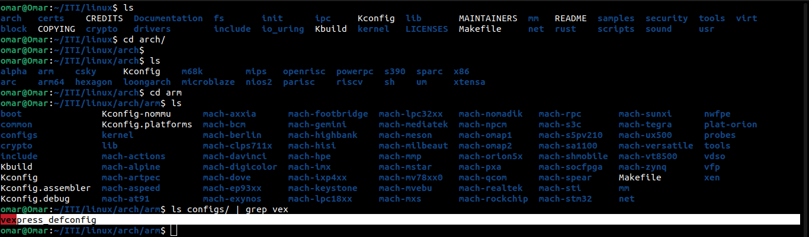 

  * As we see for Vexpress it's congfig name is `vexpress_defconfig`


* Set environment variables to configure the compiler which tearget will be used to build and the arch

  ```bash
  #export the compiler
  export CROSS_COMPILE=PathToCompiler/arm-linux-cortexa9Compiler
  #At My case 
  export CROSS_COMPILE=~/x-tools/arm-cortexa9_neon-linux-musleabihf/bin/arm-cortexa9_neon-linux-musleabihf-
  
  
  #export the architecture used
  export ARCH=arm
  ```

  

* At my Case I work on Vexpress (Qemu) so I will make the configuration kernel build based on Vexpress (Qemu)

  ```bash
  make vexpress_defconfig
  ```

  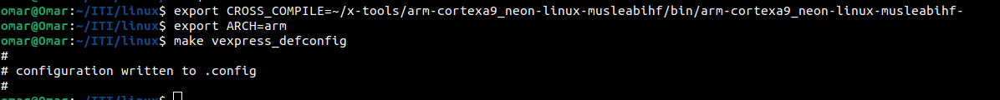

* configure the kernel with the below configuration 

  ```bash
  make menuconfig
  ```

  - [x] Enable **devtmpfs**

    >   This will instruct the kernel to automatically mount the devtmpfs filesystem at /dev, directly after the kernel has mounted the root filesystem.

    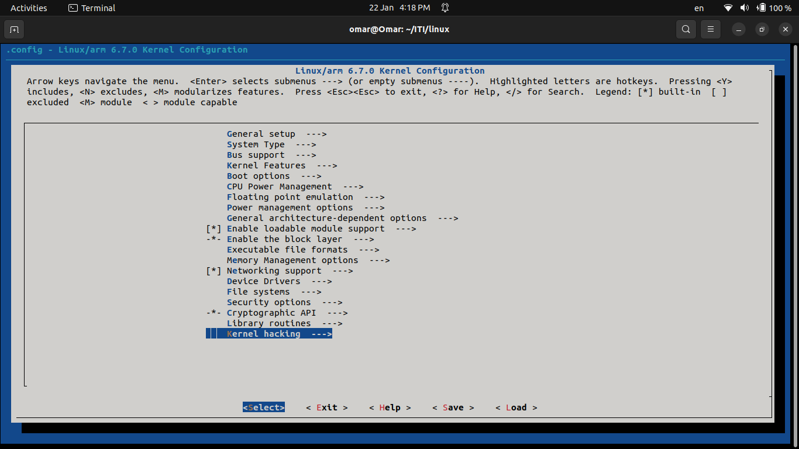

    * We will type `\` to search on **devtmpfs** location 

    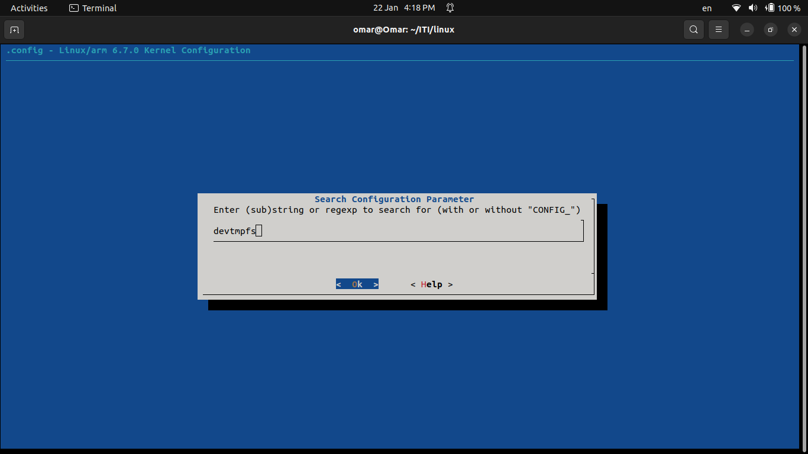

    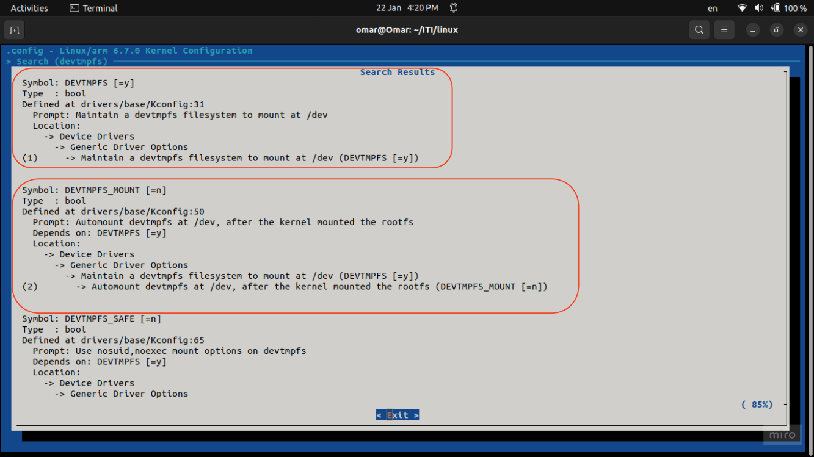
  
    * Go to this direction and enable it 
  
    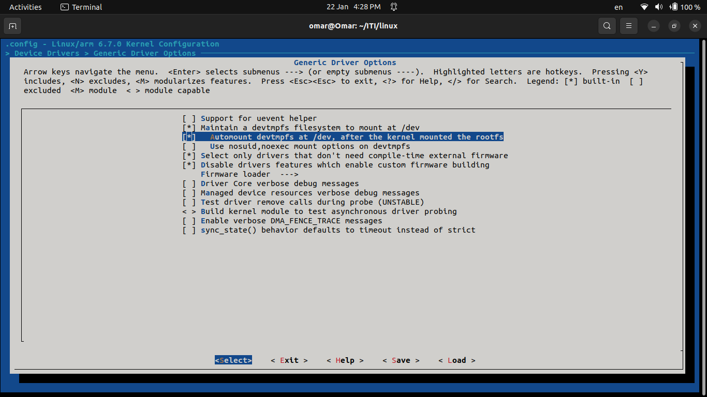
  
  - [x]  Change kernel compression to **XZ**
  
    > The phrase "**Change kernel compression to XZ**" refers to a modification in the way the Linux kernel is compressed during the build process. The Linux kernel source code can be configured to use different compression algorithms to reduce the size of the kernel image. XZ is one such compression algorithm.
  
    - By searching
  
    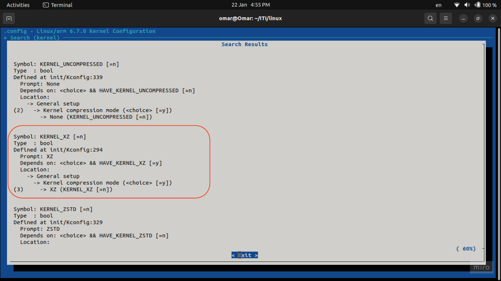
  
    * Now got the the oath and change it to **XZ**
  
    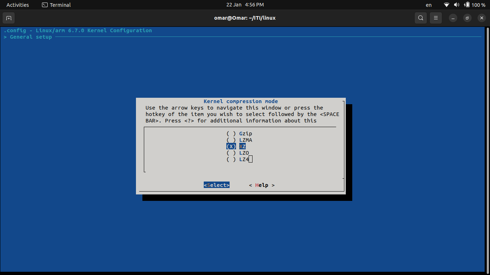
  
    * Save changes 
  
      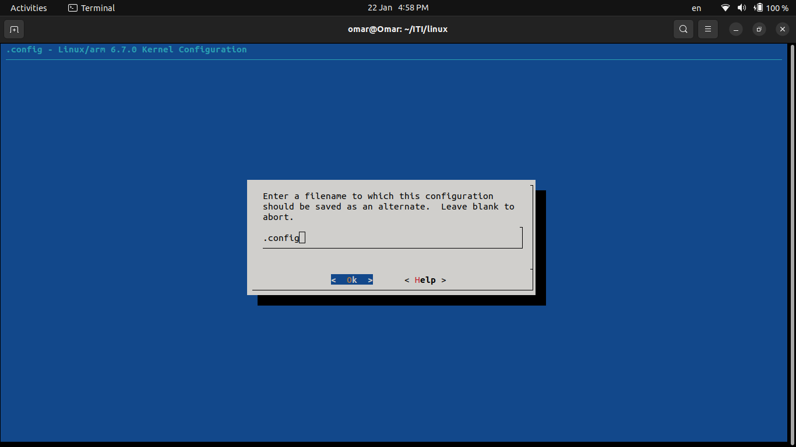

### 1.2. Build the kernel


* Now I'll build the kernel 

  * Run this command

  ```bash
  make -j8 zImage modules dtbs
  ```

  > `make`: This is a command-line utility that is commonly used in software development for building (compiling) programs and managing dependencies.
  >
  > `-j8`: This option specifies the number of parallel jobs that make is allowed to run. In this case, -j8 indicates that up to 8 parallel jobs can be executed simultaneously during the build process. This can significantly speed up the compilation process, especially on systems with multiple processor cores.
  > so you can see your cores and threds frm `lscpu` and put a sitable value for j
  >
  > `zImage`: This is the target to be built. In the context of building the Linux kernel, zImage refers to the compressed kernel image. The zImage file typically contains the compressed kernel code and is used during the boot process.
  >
  > modules: This target indicates that the kernel modules should be built. Kernel modules are pieces of code that can be dynamically loaded into the running kernel to add functionality. Building modules separately allows for more efficient development and testing.
  >
  > `dtbs`: This target is used to build the Device Tree Blob (DTB) files. Device trees are a data structure that describes the hardware components of a system. The DTB files are used by the bootloader to provide information to the Linux kernel about the hardware platform.

  * #### 1.2.1. Error 1 :

    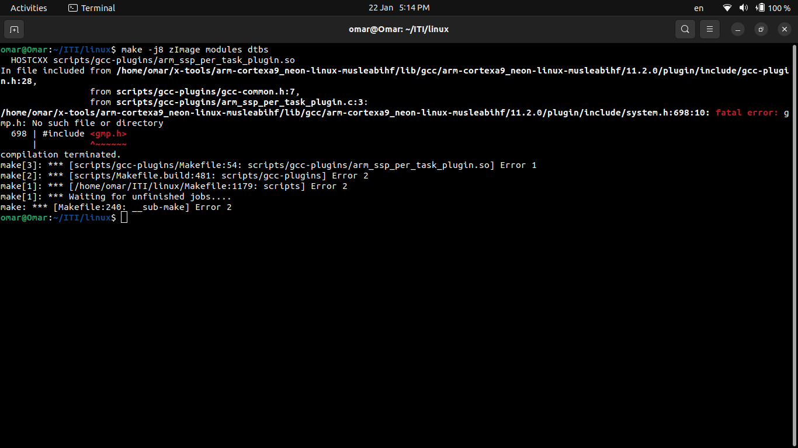

    * To resolve this issue, you need to make sure that the GMP development package is installed on your system or is available in your cross-compilation environment. You can typically install the GMP development package using the package manager of your Linux distribution.

      ```bash
      sudo apt-get install libgmp-dev
      
      #Then rebuild
      make -j8 zImage modules dtbs
      ```

  * #### 1.2.2. Error 2 :

    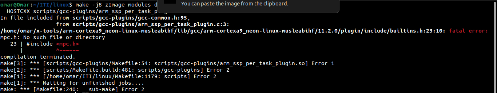

    * To resolve this issue, you need to make sure that the MPC development package is installed in your cross-compilation environment. As before, you can use the package manager specific to your environment to install the necessary package. For example, on Debian-based systems:

      ```bash
      sudo apt-get install libmpc-dev
      #Then rebuild
      make -j8 zImage modules dtbs
      ```

  * #### 1.2.3. Re-build And Wait

    *  Wait Until finishing the building process and  now we finish building the kernel successfully 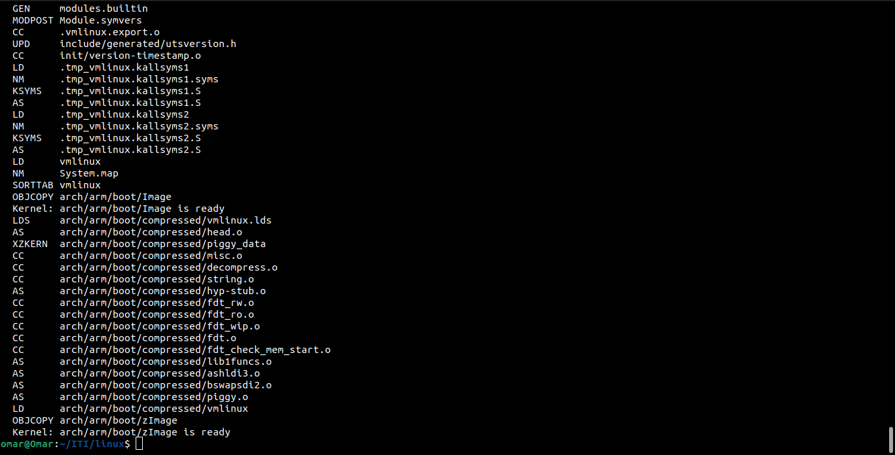


## 2. Kernel Properties After Building

* After build you can notice that a new file has been created under name of `vmlinux` when you try to see it's size 
  ```bash
  du -sh vmlinux
  ```
  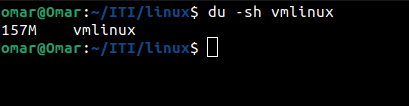

  * The size of this kernel is too big to load on our machine to run in ram as our memory is 128 MB because this file has a all debug information for debugging process so we need to get  the binary or hex file only without debugging information  and symbols 
  
  * Make create this file to you during building under this path
  
  
   ```bash
  cd arch/arm/boot/
   ```
  
  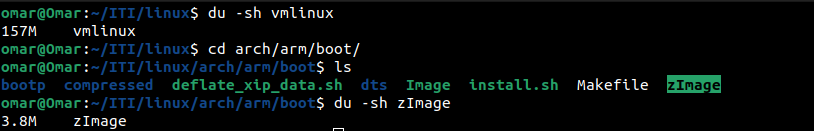
  
   > You can notice also that this file size is only 3.8 MB so it's suitable for our target 
  
* For dtb file you can find it under this path under the name of `vexpress-v2p-ca9.dtb`

  ```bash
  cd arch/arm/boot//dts/arm
  ```

  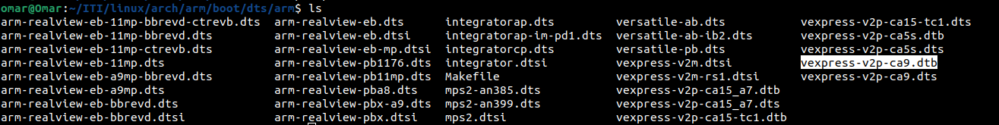

## 3. Boot kernel from TFTP server using Qemu

* Copy `zImage` and `vexpress-v2p-ca9.dtb`to TFTP directory on PC

  ```bash
  sudo cp ~/ITI/linux/arch/arm/boot/zImage /srv/tftp
  sudo cp ~/ITI/linux/arch/arm/boot/dts/arm/vexpress-v2p-ca9.dtb /srv/tftp
  ```

  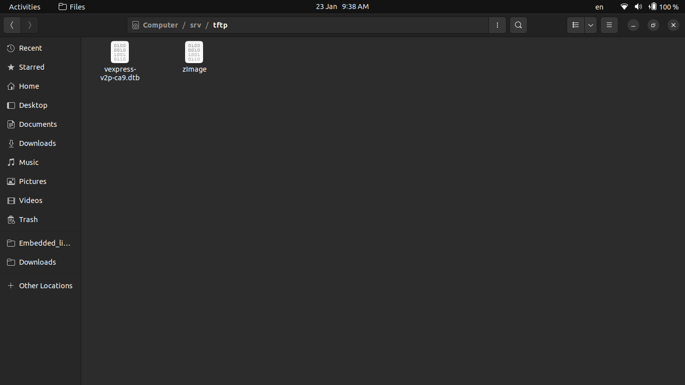

* In U-boot we make a script to QEMU to responsible for configuring the Server network interface (TAP) as we have only on network interface for my pc so i  will make a virtual interface to use it between QEMU and TFTB server so now make sure that your current IP address is the same if not change it in the script 

  ```bash
  ip addr
  ```

  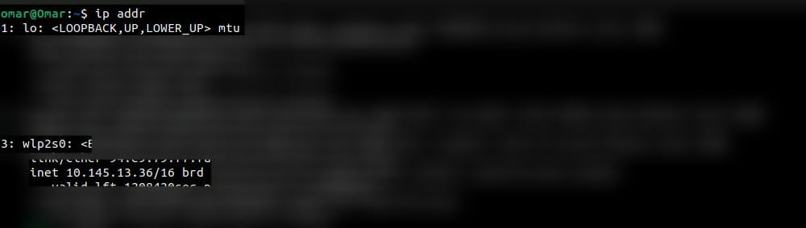

  * Change the IP in the script `qemu-ifup` in U-boot and save

    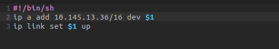

* Run Qemu 

  ```bash
  sudo qemu-system-arm -M vexpress-a9 -m 128M -nographic \
  -kernel ITI/u-boot/u-boot \
  -sd sd.img \
  -net tap,script=ITI/u-boot/./qemu-ifup -net nic
  ```

  > - `sudo`: Run the command with superuser privileges.
  > - `qemu-system-arm`: Start QEMU with the system emulation for ARM architecture.
  > - `-M vexpress-a9`: Specifies the machine model to emulate. In this case, it's set to `vexpress-a9`, representing the ARM Versatile Express development board with an ARM Cortex-A9 processor.
  > - `-m 128M`: Sets the amount of DRAM (memory) for the virtual machine to 128 megabytes.
  > - `-nographic`: Runs QEMU in a non-graphical mode, meaning it doesn't open a graphical window. This is useful for environments without a graphical display, and the console output is redirected to the terminal.
  > - `-kernel ITI/u-boot/u-boot`: Specifies the path to the kernel or bootloader image that QEMU should use. In this case, it points to the U-Boot bootloader (`u-boot`) located in the specified path (`ITI/u-boot/u-boot`).
  > - `-sd sd.img`: Specifies the SD card image (`sd.img`) to be used by the virtual machine. The SD card likely contains the required boot files and filesystem for the operating system.
  > - `-net tap,script=ITI/u-boot/./qemu-ifup -net nic`: Configures the network settings for QEMU. It sets up a TAP (network tap) device and connects it to a NIC (Network Interface Card). The `script=ITI/u-boot/./qemu-ifup` part specifies a script (`qemu-ifup`) to run for setting up the TAP interface. The `-net nic` part specifies the type of network interface card to use.

* Re-Setup U-Boot IP address

  ```bash
  #Set the server ip address that we get from previous slide
  setenv serverip [host ip address]
  
  #Apply ip address for embedded device
  setenv ipaddr [chose]
  
  #Example
  setenv serverip 10.145.13.36
  
  #Make sure that you choose an IP address that hasn't been used by another device on pc 
  setenv ipaddr 10.145.13.251
  
  saveenv
  ```

* Load kernel from TFTP server 

  ```bash
  tftp ${Kernel_address} zImage
  tftp ${fdt_address} vexpress-v2p-ca9.dtb
  ```

  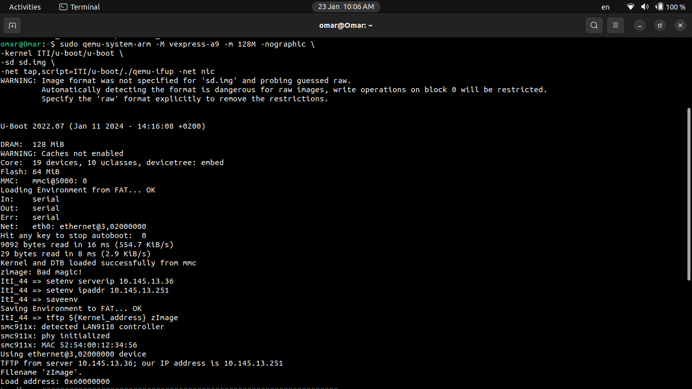

  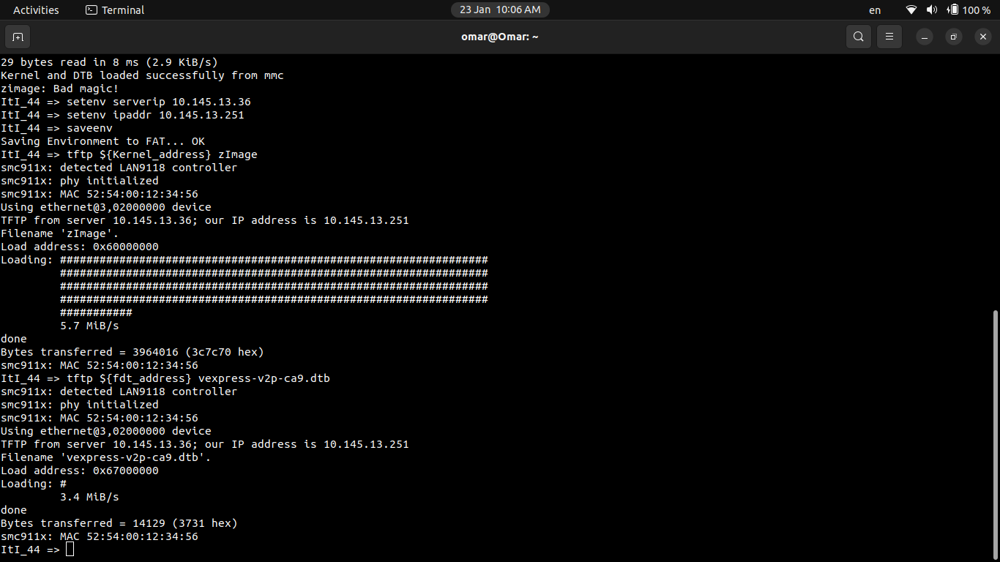

* Now try to boot the Linux kernel using the specified kernel image and device tree blob addresses. by `bootz` command

  ```
  bootz ${Kernel_address} - ${fdt_address}
  ```

  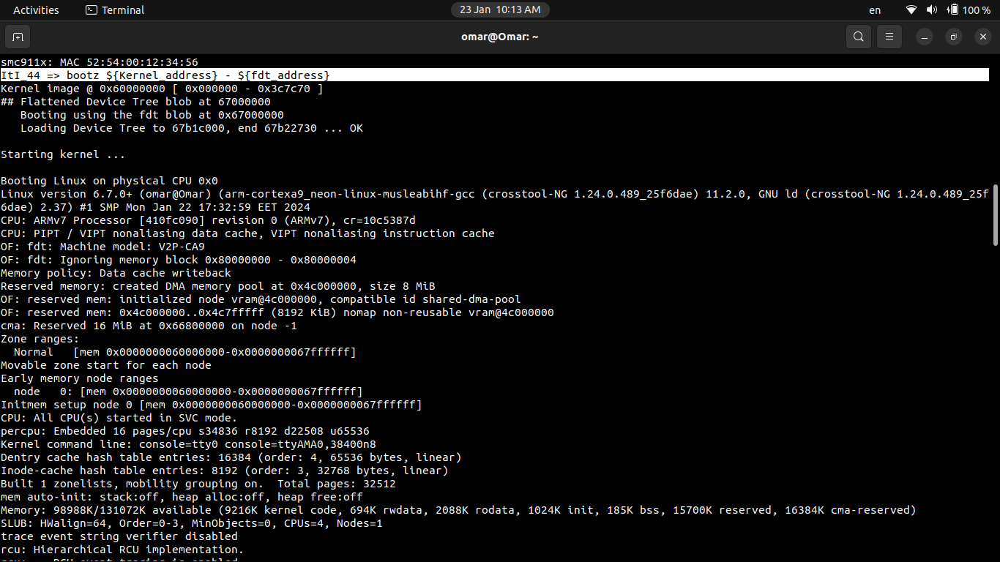

* Now successfully we build and run the kernel Image


## 4. Abstraction

* In U-boot I make an Abstraction for booting from mmc or TFTP as when the system boot it will search on the mmc first if it has the kernel images or not if not it will search on TFTP so we will modify the code of abstraction now to be applicable with our new files 

* I just need to modify  `Load_from_TFTP` environment variable as below 

  ```bash
  setenv Load_from_TFTP 'if tftp ${Kernel_address} zimage;then tftp ${fdt_address} vexpress-v2p-ca9.dtb;fi'
  
  saveenv
  ```


## 5. References 

* https://github.com/FadyKhalil/EmbeddedLinux/tree/main/4-kernel