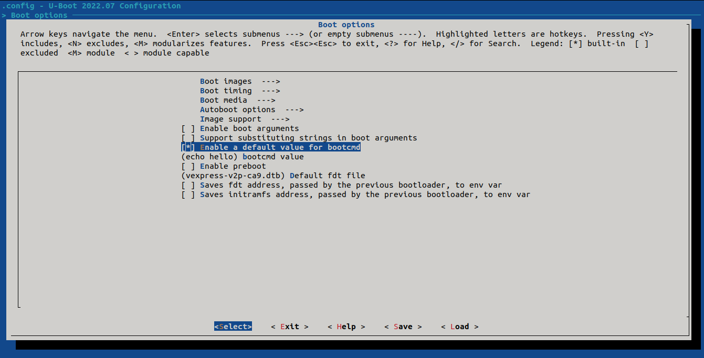

# U-boot (BootLoader)

U-Boot, short for Universal Boot Loader, is an open-source, primary boot loader used in embedded systems. It is designed to load and initialize the operating system or firmware on a device, typically in embedded systems such as single-board computers, development boards, and other devices with limited resources.

U-Boot is widely used in the embedded industry and supports a variety of architectures, including ARM, MIPS, x86, and others. It provides a flexible and configurable environment that allows developers to customize the boot process according to the specific requirements of their target hardware.

## Table of Contents

- [1. Booting Sequence](#1-booting-sequence)
  - [1.1. For x86 machines](#11-for-x86-machines)
  - [1.2. For Rasp.Pi](#12-for-rasppi)
  - [1.3. For Beaglebone](#13-for-beaglebone)
- [2. Install U-boot](#2-install-u-boot)
  - [2.1. Configure U-boot Machine](#21-configure-u-boot-machine)
  - [2.2. Configure U-Boot](#22-configure-u-boot)
  - [2.3. Build U-boot](#23-build-u-boot)
- [3. SD card](#3-sd-card)
  - [3.1. General Notes for virtual SD card](#31-general-notes-for-virtual-sd-card)
- [4. References](#4-references)

## 1. Booting Sequence

* For x86 machines

  

* For Rasp.Pi

  

* For Beaglebone

  

## 2. Install U-boot

- Clone U-boot form it's repo

  ```bash
  git clone git@github.com:u-boot/u-boot.git
  ```

* Go to U-boot directory and and checkout on v2022.07 version

  ```bash
  cd u-boot/
  git checkout v2022.07
  ```

  ### 2.1. **Configure U-boot Machine**

  * In this section you will identify which U-Boot configurations are available for your specific hardware platform or board. Configuration files in U-Boot define build options and settings for a particular target machine or board. Each board or machine typically has its own configuration file to tailor U-Boot for that specific hardware environment.

    ```bash
    # In order to find the machines supported by U-Boot
    ls configs/ | grep [your machine] 
    #Example 
    # In order to find the machine supported by U-Boot
    ls configs/ | grep vexpress_ca9
    ```

  * **For Vexpress Cortex A9 (Qemu)**

    

  * Now Cross compiler needs  variables to be set before build U-boot according to my machine Cortex A9 so set them


  ```bash
  #Path of ARM Cortex A9 compiler which had generated by crosstool-ng 
  #We will use it to compile U-boot to be compatible with with our target
  export CROSS_COMPILE=~/x-tools/arm-cortexa9_neon-linux-musleabihf/bin/arm-cortexa9_neon-linux-musleabihf-
  #Specify the second environment variable as we work on ARM arch
  export ARCH=arm
  #Use the default configurations of ARM Vexpress Cortex A9
  make vexpress_ca9x4_defconfig
  ```

  

### 	2.2. Configure U-Boot

*  In this part we will configure U-boot to a specific configurations and   illustrate them for the specific board chosen up.

  ```bash
  make menuconfig
  ```

  

- [x] Support **editenv** and **saveenv**
  * The **editenv** command in U-Boot is used to interactively edit the U-Boot environment variables. The U-Boot environment stores configuration settings that are used by the bootloader and potentially by the operating system that U-Boot boots.
  * In U-Boot, the **saveenv** command is used to save changes made to the U-Boot environment variables to non-volatile storage. The U-Boot environment variables store configuration settings that affect the behavior of the bootloader and, consequently, the boot process.

> `We can Search on any configuration by press '/' from keyboard and type the configuration on the pop up window like this image

* After searching 

  

* So we go to the path which will be mentioned in this windows

  
  
  

- [x] Enable a default value for **bootcmd** 

  * **bootcmd** : U-Boot, the bootcmd environment variable is a key variable that defines the command or sequence of commands to be executed when the bootloader attempts to boot the system. It specifies the default boot command that U-Boot should execute if no explicit boot command is provided during the boot process.

    User can change the value of **bootcmd** in menuconfic by edit **bootcmd value** for initiation in the first time after compilation at my case i configure it to print hello word by set it by **echo hello** command

  * **(vexpress-v2p-ca9.dtb)** Default fdt file  

    It has a hardware description for system which will be used

    

- [x]  Support **bootd** and **run** .
  - **bootd** it's a a command which has the **bootcmd** Contents
  - **run** command is used to execute a sequence of U-Boot commands that are defined in a U-Boot script or in the U-Boot environment. The run command allows you to create and execute custom command sequences without having to type each command individually.

* As we make in the previous Step 

  

- [x] **Shell prompt**

  * User can edit on it by the desired sentences to be written  in PS1 

    at my case i write an example Iti_44 => 

  * At Hush shell secondary prompt  user can edit PS2


- [x] Store the environment variable inside file call **uboot.env**.

  > This the file which environment variable will be saved on it 

  - [x]  Unset support of **Flash** 

  > As we don't have a flash disk port to boot from it

  - [x]  Support FAT file system

  > As the target support booting from FAT partition

  -  Configure the FAT interface to **mmc**

    >   Define this to a string that is the name of the block device.                                                                                 

  -  Configure the partition where the fat is store to **0:1**

    > 0 : Represented the block storage device number (At my case it's virtual SD card)
    >
    > 1 : Represented fat partition number in the virtual SD card


Now Exit and Save


### 	2.3. Build U-boot

* Now we will build U-boot using the previous configuartion

  ```bash
  make
  ```

  You can find the generated u-boot file in the current directory u-boot

## 3. SD card

In this section it's required to have SD card with first partition to be FAT as pre configured in **U-boot Menuconfig**.

At my case for Qemu I'll genereate a virtual SD card by those steps

* Create a file filled with zeros with a size of 1 GB

```bash
# Change directory to any directory before U-Boot
cd ..

# Create a file with 1 GB filled with zeros
dd if=/dev/zero of=sd.img bs=1M count=1024
```

> Note : Be careful to make the size of SD card to be number which it's 2 to the power n as n is an integer number ex 2^10 , 2^9

```dd```: This is a command used for copying and converting files and data. In this case, it's being used to create a file with zero-filled content. 

```if=/dev/zero```: The if flag specifies the input file, and /dev/zero is a special file in Unix-like systems that provides an endless stream of null bytes (zeros). 

```of=sd.img```: The of flag specifies the output file, and sd.img is the name of the output file that will be created. 

```bs=1M```: The bs flag sets the block size. In this case, it is set to 1 megabyte (1M). The block size determines how much data is read or written at a time. Setting it to 1 megabyte means that dd will write 1 megabyte of zeros at a time. 

```count=1024```: The count flag specifies the number of blocks to copy. In this case, it is set to 1024, so a total of 1024 blocks, each of size 1 megabyte, will be written. Therefore, the total size of the output file (sd.img) will be 1024 megabytes.

* This is the file genereted

  

* Configure the Partition Table for the SD card

  ```bash
  # for the VIRTUAL SD card
  cfdisk sd.img
  ```

* This windows will appear and the following configuration must be set

  

	|      Device      | Boot (Put * if partition is bootable) | Size | Type  |
	| :--------------: | :-----------------------------------: | :--: | :---: |
	|  sd.img1( boot)  |                   *                   | 200M | FAT16 |
	| sd.img2 (rootfs) |                                       | 823M | Linux |

* Then select **write** and type **yes**

  > Note : it's must to type yes to save the configuration 

* To emulate the sd.img file as a sd card we need to attach it to **loop driver** to be as a **block storage**

```bash
# attach the sd.img to be treated as block storage
sudo losetup -f --show --partscan sd.img

# Running the upper command will show you
# Which loop device the sd.img is connected
# take it and assign it like down bellow command

# Assign the Block device as global variable to be treated as MACRO
export DISK=/dev/loop<x>

#Examble : number of loop is 13 so 
export DISK=/dev/loop13
```

* You can show the loop which associated with your virtual SD card by run bellow commands :

  ```bash
  #replace loopX by your device loop
  losetup -a | grep <loopX>
  
  #Example
  losetup -a | grep loop13
  ```

  ```bash
  #replace loopX by your device loop
  losetup -a | grep <loopX>
  
  #Example
  losetup -a | grep loop13
  ```

	

* Format Partition Table

  * As pre configured from **cfdisk command** first partition is **FAT**

    ```bash
    sudo mkfs.vfat -F 16 -n boot ${DISK}p1
    ```

    > - `sudo`: This command is used to run the subsequent command with superuser (root) privileges. It is often required for operations that involve modifying system files or settings and loop consider as system settings .
    > - `mkfs.vfat`: This is the command to create a FAT file system. The `.vfat` suffix indicates the version of FAT being used (FAT16 or FAT32).
    > - `-F 16`: This option specifies the FAT type, and in this case, it's set to create a FAT16 file system. FAT16 is an older file system with limitations on maximum volume size and file size.
    > - `-n boot`: This option sets the volume label of the file system to "boot." The volume label is a name associated with the file system.
    > - `${DISK}p1`: This represents a variable (`${DISK}`) concatenated with "p1." The variable is expected to contain the disk identifier (e.g., `/dev/sd`) where the partition is located. "p1" indicates the first partition on that disk.

  * As pre configured from cfdisk Command second partition is linux

    ```bash
    # format the created partition by ext4
    sudo mkfs.ext4 -L rootfs ${DISK}p2
    ```

    > - `sudo`: This command is used to run the subsequent command with superuser (root) privileges.
    > - `mkfs.ext4`: This is the command to create an ext4 file system. Ext4 is a popular file system used in many Linux distributions.
    > - `-L rootfs`: This option sets the volume label of the file system to "rootfs." The volume label is a name associated with the file system.
    > - `${DISK}p2`: This represents a variable (`${DISK}`) concatenated with "p2." The variable is expected to contain the disk identifier (e.g., `/dev/sd`) where the partition is located. "p2" indicates the second partition on that disk.

* The Last step is to mount each partition

  * For FAT16

    ```bash
    #Mount p1 in loop on the /media/<username> (Which it's the place that required to mount on it)
    sudo mount -t ext4 /dev/loop13p2 /media/<username>
    
    #Example
    sudo mount -t ext4 /dev/loop13p2 /media/omar
    ```

  * For ext4

    ```bash
    #Mount p2 in loop on the /media/<username> (Which it's the place that required to mount on it)
    sudo mount -t ext4 /dev/loop13p2 /media/<username>
    
    #Example
    sudo mount -t ext4 /dev/loop13p2 /media/omar
    ```

### 3.1. General Notes for virtual SD card

For eject virtual SD card

```bash
sudo losetup -d /dev/<loopx>

#EXAMPLE
sudo losetup -d /dev/loop13
```

For re-connect it or when restart the system

```bash
sudo losetup -f --show --partscan sd.img
```

## 4. References

1. https://github.com/FadyKhalil/EmbeddedLinux/blob/main/3-Uboot/README.md
2. https://github.com/anaskhamees/Embedded_Linux/tree/main/EmbeddedLinuxTasks/BootingSequence
