# Table Of Content

- [1. Install Qemu](#1-install-qemu) 
- [2. QEMU With Virtual SD Card For Vexpress Cortex A9](#2-qemu-with-virtual-sd-card-for-vexpress-cortex-a9)  
- [3. Run Command After Booting Using Bootcmd](#3-run-command-after-booting-using-bootcmd)  
- [3.1 Initialize TFTP Protocol](#31-initialize-tftp-protocol)   
  
- [3.2 Connect QEMU with the Server Using TFTP Protocol](#32-connect-qemu-with-the-server-using-tftp-protocol) 
- [4. TFTP Protocol](#4-tftp-protocol)  
  -  [4.1 Initialize TFTP Protocol](#41-initialize-tftp-protocol)  
  -  [4.2 Connect QEMU with the Server Using TFTP Protocol](#42-connect-qemu-with-the-server-using-tftp-protocol) -
- [5. Test Cases and Abstraction](#5-test-cases-and-abstraction) -
- [6. References](#6-references)


# Qemu

QEMU, short for Quick Emulator, is an open-source emulator and virtualization tool that can be used to run operating systems and programs on a variety of architectures. It provides a framework and set of components for emulating different hardware platforms, allowing users to create and manage virtual machines (VMs) on their host systems.


## 1. Intsall Qemu 

To install Qemu user should install it drom this command 

```bash
sudo apt install qemu-arm
```


## 2. Qemu With Virtual SD Card For **Vexpress Cortex A9** 

To run a certain U-boot from SD card on  Qemu Emulation for **Vexpress Cortex A9**  machine user should Run this command 

```bash
qemu-system-arm -machine vexpress-a9 -m 128M  -sd sd.img<Path> -kernel u-boot<Path> -nographic

#Examlple
qemu-system-arm -machine  vexpress-a9 -m 128M -sd sd.img -kernel ~/ITI/u-boot/u-boot -nographic
```

> 1. **`qemu-system-arm`**: This is the QEMU command to start a virtual machine with an ARM architecture and wil run over process .
> 2. **`-machine vexpress-a9`**: Specifies the machine model to emulate. In this case, it's set to `vexpress-a9`, which represents the ARM Versatile Express development board with an ARM Cortex-A9 processor.
> 3. **`-m 128M`**: Sets the amount of DRAM for the virtual machine. In this example, it's set to 128 megabytes (`128M`) as we configure it in menuconfig from u-boot .
> 4. **`-sd sd.img`**: Specifies the SD card image (`sd.img`) to be used by the virtual machine. The SD card likely contains the required boot files and filesystem for the operating system.
> 5. **`-kernel ~/ITI/u-boot/u-boot`**: Defines the path to the kernel image that QEMU should use. In this case, it's pointing to the U-Boot bootloader (`u-boot`) located in the specified path (`~/ITI/u-boot/u-boot`).
> 6. **`-nographic`**: Runs QEMU in a non-graphical mode. This is useful for environments without a graphical display, and it typically directs the output to the console or terminal.


## 3. Run Command After Booting Using Bootcmd

* First of all we want to know the starting address of **DRAM** and **fdt** 

  ```bash
  bdinfo
  ```

  > In U-Boot, the `bdinfo` command is used to display information about the board, providing details about the board's memory configuration. The name "bdinfo" stands for "board information."

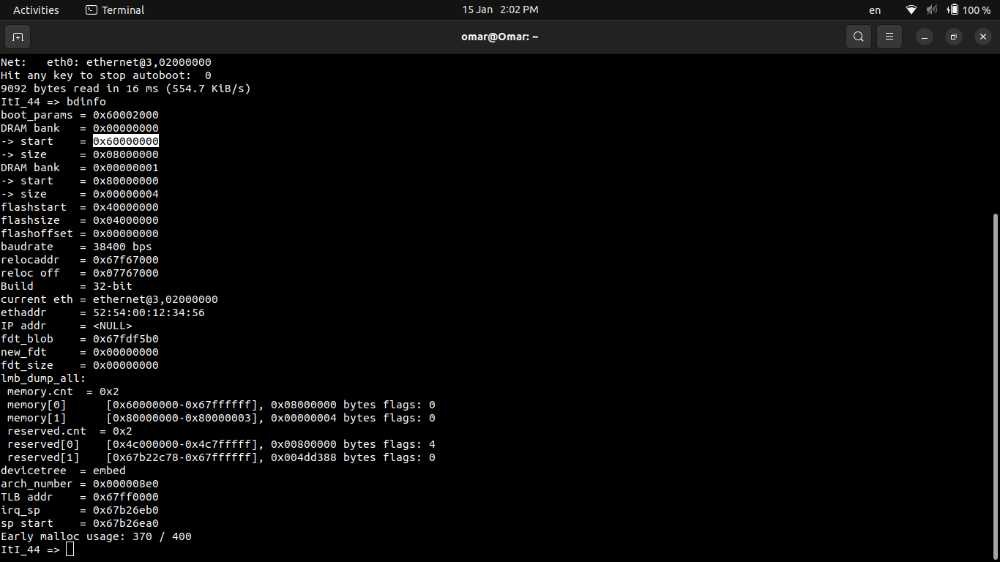

* Set Value for `Kernel_address ` with `0x60000000` which typically represents the memory address where the U-Boot bootloader will load the Linux kernel image.

* Set Value for  ` fdt_address ` with `0x67000000` which represents the memory address where the U-Boot bootloader will load the device tree blob (DTB) file.

  > Note : We set fdt_address with value between DRAM bank 1 start address and end address in case we have a size of 8000000 so the end of bank 1 is 68000000 and the start is 60000000 

  ```bash
  setenv Kernel_address 0x60000000
  setenv fdt_address 0x67000000
  saveenv
  ```

  > **`saveenv`**
  >
  > - This command saves the changes made to the U-Boot environment variables to non-volatile storage (commonly a flash memory). It makes the changes persistent across reboots.
  > - After running `saveenv`, the values of `Kernel_address` and `fdt_address` (or any other modified variables) will be stored in the U-Boot environment uboot.env and loaded automatically on subsequent boots.

* Now I create 2 files **main** to act as zimag and **beagle.dtb** to act as dtp an copy them to virtual SDcard

  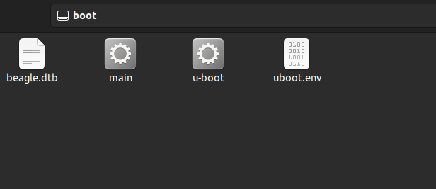

* Next step to set an environment variable that has implementation of loading main and  beagle.dtp file from Fat partition from SDcard to qemu

  ```bash
  setenv Load_from_fat 'if fatload mmc 0:1 ${Kernel_address} main ;then fatload mmc 0:1 ${fdt_address} beagle.dtb;fi'
  
  saveenv
  ```

  > This setenv command is used to define a new environment variable named `Load_from_fat`. The value assigned to this variable is a string that contains two `fatload` commands separated by a semicolon (`;`). Here's the breakdown:
  >
  > - `fatload`: This U-Boot command is used to load a file from a FAT filesystem.
  > - `mmc 0:1`: Specifies that the file should be loaded from the first partition (`1`) of the MMC/SD card (`mmc 0`).
  > - `$Kernel_address`: This is a variable substitution. The actual value of the `Kernel_address` variable is used here.
  > - `main`: This is the name of the file (`main`) that U-Boot should load.
  > -  loads a file (`beagle.dtb`) from the first partition of the mmc/SD card using the address specified by the `fdt_address` variable.
  > - The `saveenv` command is used to save the changes made to the U-Boot environment variables to non-volatile storage, ensuring that the new `Load_from_fat` variable is persisted across reboots.

* Next step to append this process after booting by append `Load_from_fat`variable on `bootcmd` and check if it loads correctly or not 

  ```bash
  setenv bootcmd 'if run Load_from_fat;then echo "Kernel and DTB loaded successfully";bootz ${Kernel_address} - ${fdt_address};else echo "Failed to load kernel or DTB"; fi'
  saveenv
  ```

  > - `setenv bootcmd`: This command sets the U-Boot environment variable named `bootcmd`.
  > - `'if run Load_from_fat; then echo "Kernel and DTB loaded successfully"; bootz ${Kernel_address} - ${fdt_address}; else echo "Failed to load kernel or DTB"; fi'`: This is a compound shell command enclosed in single quotes (`'`). Let's break down the structure:
  >   - `if run Load_from_fat; then`: Initiates an if-then conditional block. It checks the result of the command `run Load_from_fat`.
  >   - `echo "Kernel and DTB loaded successfully";`: If the `Load_from_fat` command is successful, it echoes the message "Kernel and DTB loaded successfully".
  >   - `bootz ${Kernel_address} - ${fdt_address};`: This line is executed if the `Load_from_fat` command is successful. It uses the `bootz` command to boot the kernel with the specified addresses.
  >   - `else echo "Failed to load kernel or DTB"; fi`: If the `Load_from_fat` command is not successful, it echoes the message "Failed to load kernel or DTB".
  >   - IMPORTANT NOTE : I put `bootz ${Kernel_address} - ${fdt_address};`  after checking and successful of boot from fat `zimage `and `dtb file` as we just try the successive of loading  from partition  but those files not a real `zimage` or `dtp` so when `bootz` run it will print `zimage : Bad magic !` as we don't have a real files for kernel yet we just test 
  
  * Before run the command
  
    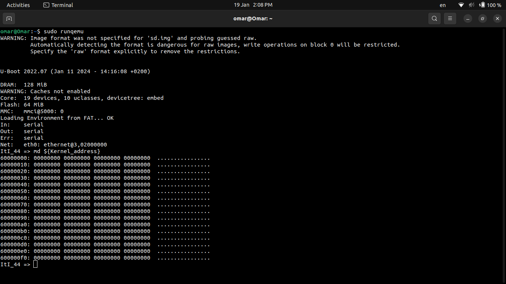
  
    > We notice that bootd is empty and contain of kernel address is nothing
  
    
    >       We notice that contain of fdt_address is nothing
  
  * After run the command
  
    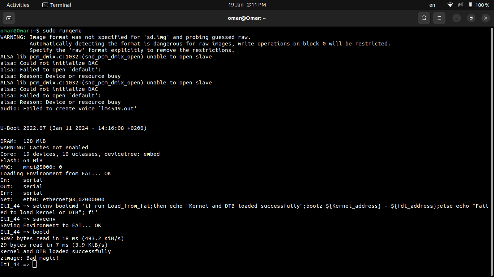
  
    * When I try to see the contains of `Kernel_address` and `fdt_address` 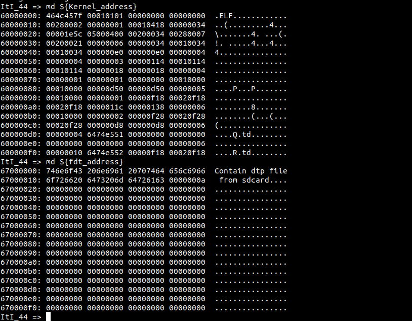
  
       > We succeed to load `main(zimage)` and `dtp` file to load in RAM after booting by using `bootcmd`

## 4. TFTP protocol

* TFTP stands for Trivial File Transfer Protocol. TFTP is defined as a protocol that is used to transfer a file from a client to a server and from a server to a client. TFTP is majorly used when no complex interactions are required by the client and server. The service of TFTP is provided by [UDP](https://www.geeksforgeeks.org/user-datagram-protocol-udp/) (User Datagram Protocol) and works on port number 69. TFTP does not provide security features therefore it is not used in communications that take place over the Internet. Therefore it is used only for the systems that are set up on the local internet. TFTP requires less amount of memory.

  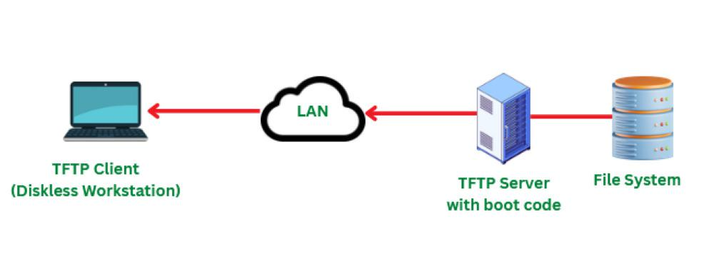

* In my case my TFTP server will be the local laptop and I will load the zimage and dtb drom my target which simulated by qemu .

### 4.1. Initialize TFTP protocol

* Install TFTP protocol on linux 

```bash
#Download tftp protocol
sudo apt-get install tftpd-hpa
```

* After installing you will find that a directory has been be created on `/srv` it's name `tftp`this will be **the server directory of my virtual server on my laptop**

  

* Make sure the tftp protocol is running

  ```bash
  systemctl status tftpd-hpa
  ```

  > 
  > The command `systemctl status tftpd-hpa` is used to check the status of the `tftpd-hpa` service using the `systemd` system and service manager on Linux systems. Here's an explanation of each part of the command:
  >
  > - **`systemctl`**: This command is a central management tool for controlling the `systemd` system and service manager. It is used to examine and control the state of the system and its services.
  > - **`status`**: This is an option used with `systemctl` to display the current status and some details about a specific service.
  > - **`tftpd-hpa`**: This is the name of the service you want to check. In this case, it refers to the Trivial File Transfer Protocol (TFTP) server managed by `tftpd-hpa`.
  
  ​	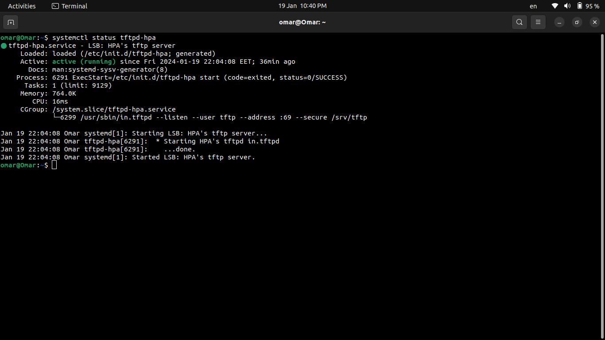

  > *  **Loaded:** Indicates whether the service unit file has been loaded.
  >
  > - **Active:** Shows whether the service is currently running (`active` and `running` mean it's running).
  > - **Main PID:** Displays the process ID of the main process of the service.
  > - **Tasks:** Indicates the number of tasks (threads) being managed by the service.
  > - **CGroup:** Specifies the control group in which the service is running.
  > - **Start time and uptime information:** Provides information about when the service was started and how long it has been running.
  > - **Process information:** Displays the command used to start the service and the status of the process.

* Now we should change the configuration of tftp

  ```bash
  sudo nano /etc/default/tftpd-hpa
  ```

  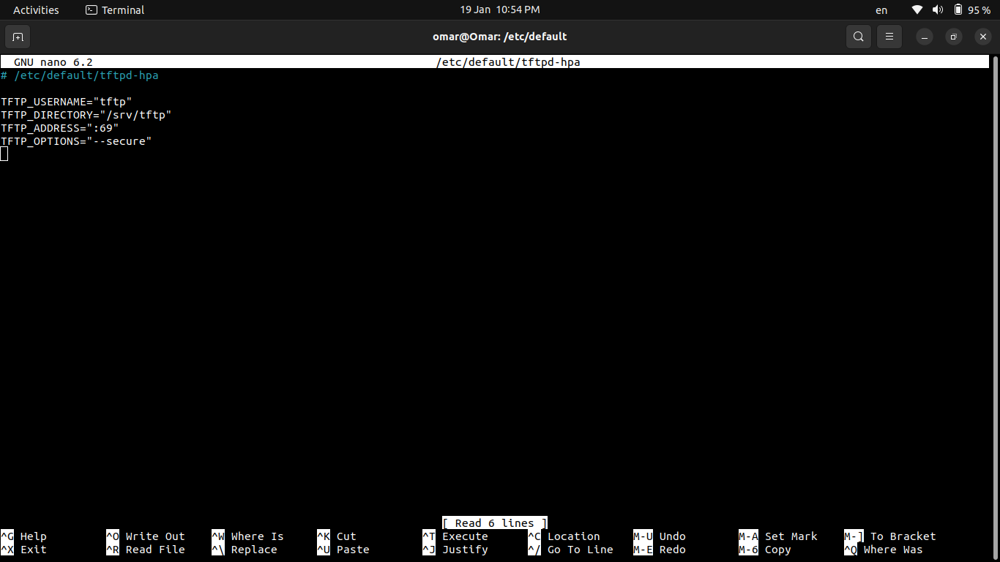

  > Usually you will find It's default configuration by this shape       

* We need to modify `tftf_option`

  ```bash
  TFTP_OPTIONS= = “--secure –-create”
  ```

  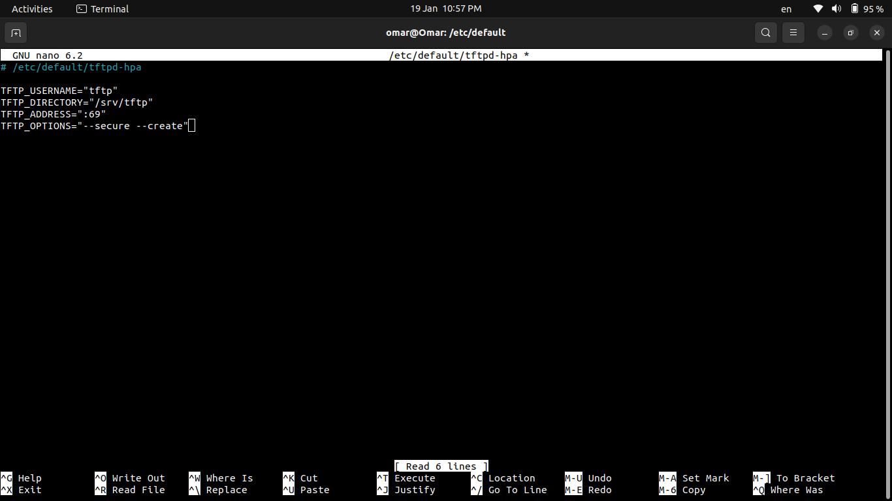

  > In TFTP (Trivial File Transfer Protocol), the `--secure` option is used to enable security features that prevent certain risky operations, such as writing to files outside of the TFTP root directory. Adding the `--create` option in addition to `--secure` allows the TFTP server to create files.
  >
  > When you change the `TFTP_OPTIONS` from `--secure` to `--secure --create`, you are allowing the TFTP server to create files in addition to the security restrictions provided by the `--secure` option. This can be useful in scenarios where you want the TFTP server to not only read files but also create new files during file transfers.
  >
  > Here's a breakdown of the options:
  >
  > - **`--secure`**: This option restricts the TFTP server to a specific directory (often referred to as the TFTP root directory) and prevents operations that might lead to accessing files outside of this directory. It enhances security by containing TFTP operations within a defined scope.
  > - **`--create`**: This option allows the TFTP server to create new files. Without this option, the TFTP server might be restricted to reading existing files but not creating new ones. Adding `--create` is useful if you want to allow file creation during TFTP transfers.

* Now restart the protocal and make sure the tftp protocol is running

  ```bash
  systemctl restart tftpd-hpa
  systemctl status tftpd-hpa
  ```

  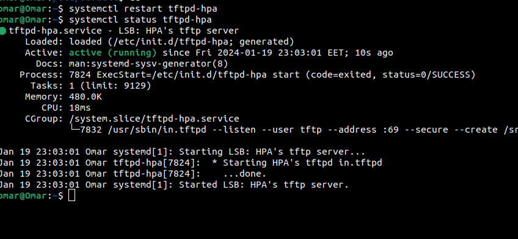

* If you see the permissions of `/serv/tftp` by this command

  ```bash
  ls -la /srv/tftp
  ```

  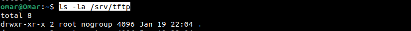

  > The screen shows the the owner of the TFTP directory which act as sever directory is root and it hasn't a group however TFTP should have the all responsibility to write in this  directory so we will change the owner and the group to TFTP

* Change Owner and group of TFTP directory 

  ```bash
  cd /srv
  sudo chown tftp:tftp tftp 
  
  #Then check permissions again
  ls -la /srv/tftp
  ```

  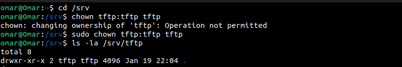

  

* Create virtual files in `/srv/tftp` to treat as `ziamge `and `dtb` file which will be loaded from the server

  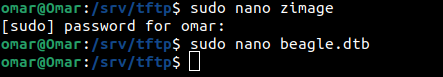

  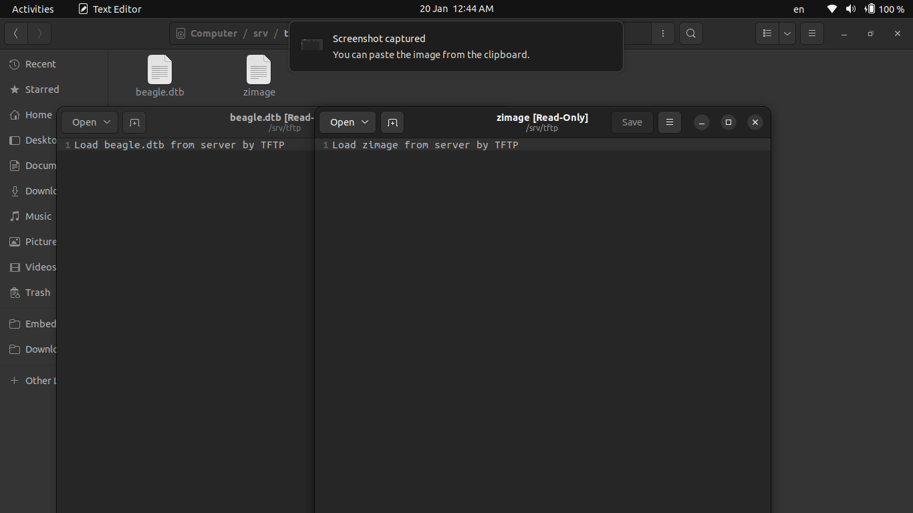

  

### 4.2. Connect QEMU with the server using TFTP  protocol 

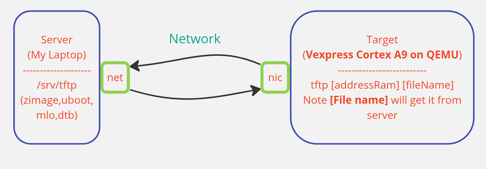

* As we see to connect the server which we initialized with QEMU we need to connect them which each other with net a nic which acts as cable wire and we need to give an ip address to each one of them so we will do the upcoming steps

  * Check the  ip address of my local machine

    ```bash
    ip addr
    ```

    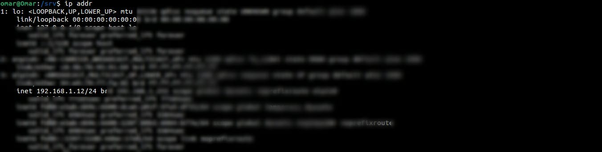

    > In this output:
    >
    > - The IP address is associated with the `wlp2s0` interface.
    > - The line `inet 192.168.1.12/24` indicates that the IP address is `192.168.1.12`, and it's part of the `192.168.1.0/24` subnet.
    > - The `wlp2s0` interface represents a wireless connection.

  * Make a script in U-boot directory with your machine IP it's name is `qemu-ifup` . t is responsible for configuring the Server network interface (TAP) as we have only on network interface for my pc so i  will make a virtual interface to use it between QEMU and TFTB server

    ```bash
    #!/bin/sh
    # Assign the provided IP address (192.168.1.12/24) to the specified interface
    ip a add 192.168.1.12/24 dev $1
    # Set the specified interface up (activate it)
    ip link set $1 up
    ```

    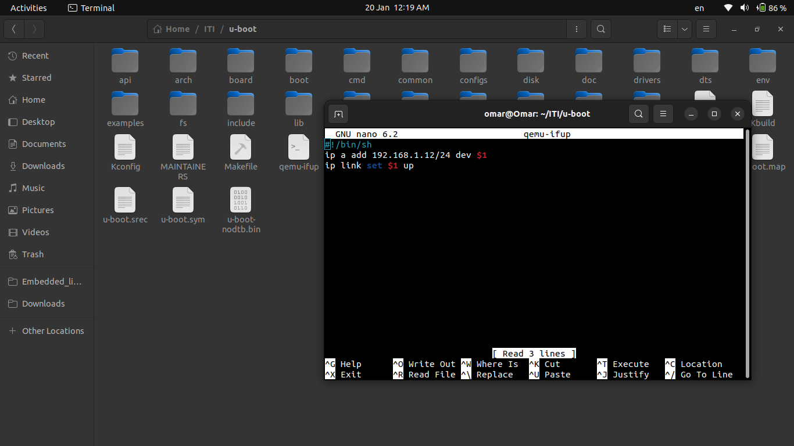

  * Change it's mode to be executable 

    ```bash
    chmod +x qemu-ifup
    ```

    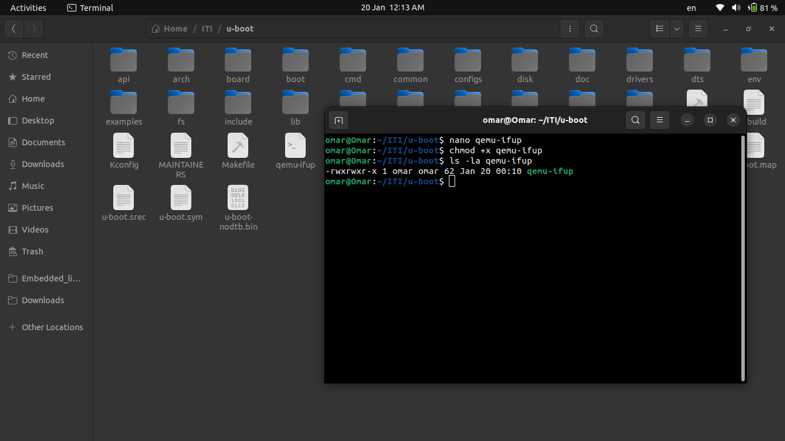

  * Run QEMU with the new virtual ethernet

    ```bash
    #For readability but not write like that
    sudo qemu-system-arm -M vexpress-a9 -m 128M -nographic \
    -kernel u-boot/u-boot \
    -sd sd.img \
    -net tap,script=./qemu-ifup -net nic
    
    #Example for my case 
    sudo qemu-system-arm -M vexpress-a9 -m 128M -nographic -kernel ITI/u-boot/u-boot -sd sd.img -net tap,script=ITI/u-boot/./qemu-ifup -net nic
    
    ```

    > - `sudo`: Run the command with superuser privileges.
    > - `qemu-system-arm`: Start QEMU with the system emulation for ARM architecture.
    > - `-M vexpress-a9`: Specifies the machine model to emulate. In this case, it's set to `vexpress-a9`, representing the ARM Versatile Express development board with an ARM Cortex-A9 processor.
    > - `-m 128M`: Sets the amount of DRAM (memory) for the virtual machine to 128 megabytes.
    > - `-nographic`: Runs QEMU in a non-graphical mode, meaning it doesn't open a graphical window. This is useful for environments without a graphical display, and the console output is redirected to the terminal.
    > - `-kernel ITI/u-boot/u-boot`: Specifies the path to the kernel or bootloader image that QEMU should use. In this case, it points to the U-Boot bootloader (`u-boot`) located in the specified path (`ITI/u-boot/u-boot`).
    > - `-sd sd.img`: Specifies the SD card image (`sd.img`) to be used by the virtual machine. The SD card likely contains the required boot files and filesystem for the operating system.
    > - `-net tap,script=ITI/u-boot/./qemu-ifup -net nic`: Configures the network settings for QEMU. It sets up a TAP (network tap) device and connects it to a NIC (Network Interface Card). The `script=ITI/u-boot/./qemu-ifup` part specifies a script (`qemu-ifup`) to run for setting up the TAP interface. The `-net nic` part specifies the type of network interface card to use.

    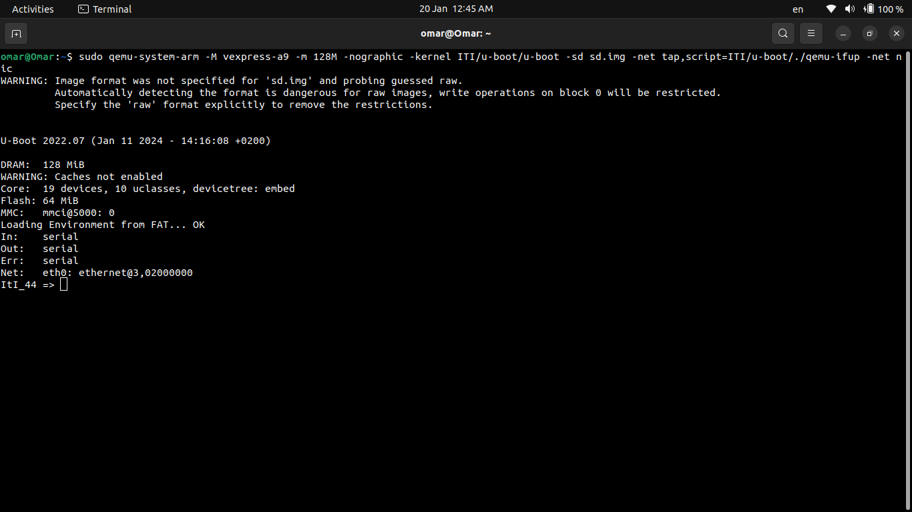

  * Setup U-Boot IP address

    ```bash
    Set the server ip address that we get from previous slide
    setenv serverip [host ip address]
    
    #Apply ip address for embedded device
    setenv ipaddr [chose]
    
    #Example
    setenv serverip 192.168.1.12
    
    #Make sure that you choose an IP address that hasn't been used by another device on pc 
    setenv ipaddr 192.168.1.178
    ```

* Loading the files ( Zimage and beagle.dbt which I created them above) from the server

  ```
  tftp ${Kernel_address} zimage
  tftp ${fdt_address} beagle.dtb
  ```

  * Before 

    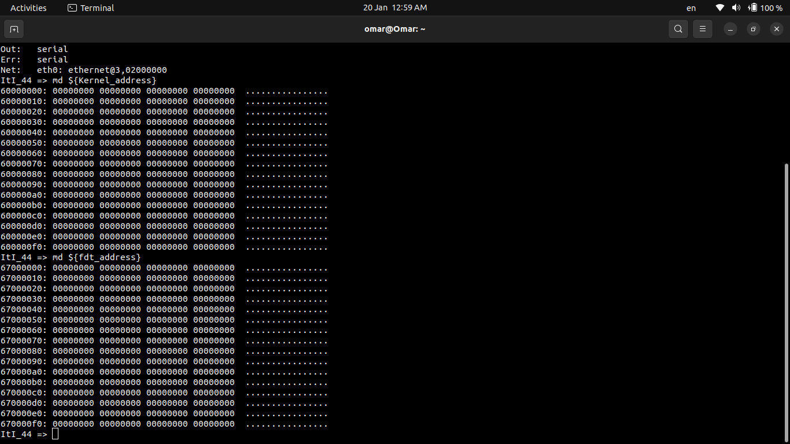

  * After 

    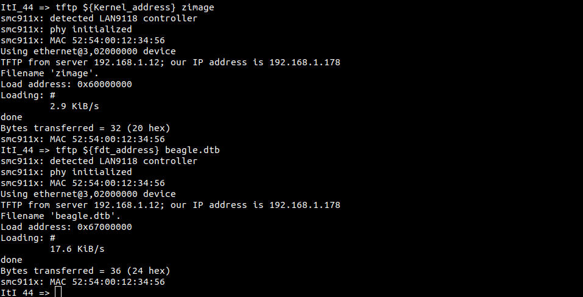

    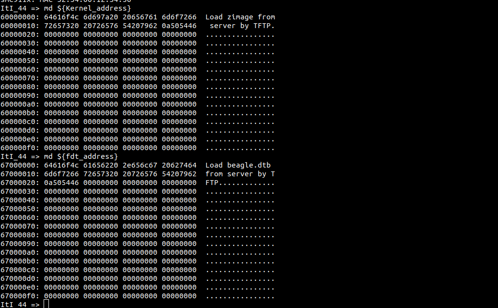

* Finally we succeed to load from server using TFTP protocol 

## 5. Test Cases and Abstraction

Now we make 2 Parts First we try to load from virtual SD Card the we try to load from server using TFTP protocol we will generalize booting sequence for our target to :

* Search if booting files is available on the SD card or not     

  * Yes : Boot from SD card
  * No : 
    * Search if booting files is available on remote server or not
      * Yes : git the files from the server then boot
      * No : Print No zimage or dtb file detected on mmc of server

* We will write this conditions in `bootcmd`

  ```bash
  setenv Load_from_TFTP 'if tftp ${Kernel_address} zimage;then tftp ${fdt_address} beagle.dtb;fi'
  
  setenv bootcmd 'if run Load_from_fat; then echo "Kernel and DTB loaded successfully from mmc"; bootz ${Kernel_address} - ${fdt_address}; else echo "Failed to load kernel or DTB from mmc"; if run Load_from_TFTP; then echo "Kernel and DTB loaded successfully from TFTP"; bootz ${Kernel_address} - ${fdt_address}; else echo "Failed to load kernel or DTB from TFTP"; fi; fi'
  
  #For more readbabilty but 
  #NOT WRITE IT LIKE THAT!!
  setenv bootcmd 'if run Load_from_fat; then 
      echo "Kernel and DTB loaded successfully from mmc"; 
      bootz ${Kernel_address} - ${fdt_address}; 
  else 
      echo "Failed to load kernel or DTB from mmc"; 
      if run Load_from_TFTP; then 
          echo "Kernel and DTB loaded successfully from TFTP"; 
          bootz ${Kernel_address} - ${fdt_address}; 
      else 
          echo "Failed to load kernel or DTB from TFTP"; 
      fi; 
  fi'
  
  saveenv
  ```

  * Case 1 : zimage (main) and dtb file exist in mmc

    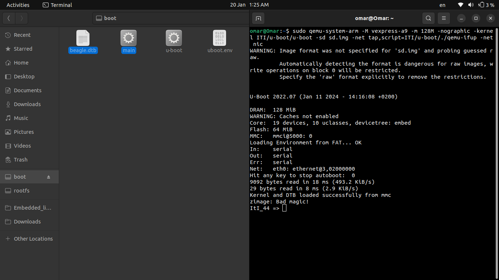

  * Case 2 : zimage (main) exists in mmc but dtb file does not 

    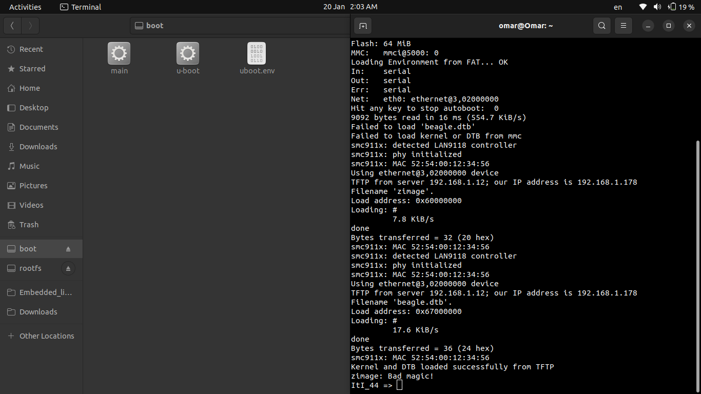
    
  * Case 3 : dtb exists in mmc but dtb file is not zimage (main)
  
    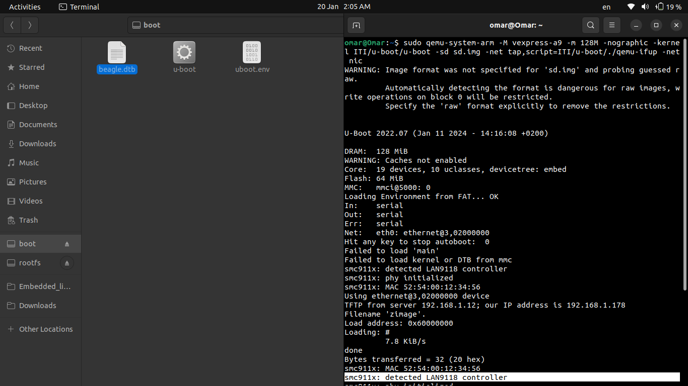
  
  * Case 4 :  zimage (main) and dtb file exist in mmc and files is missing from mmc
  
    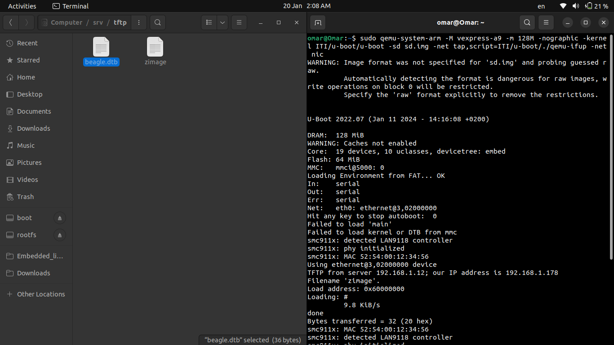
  
    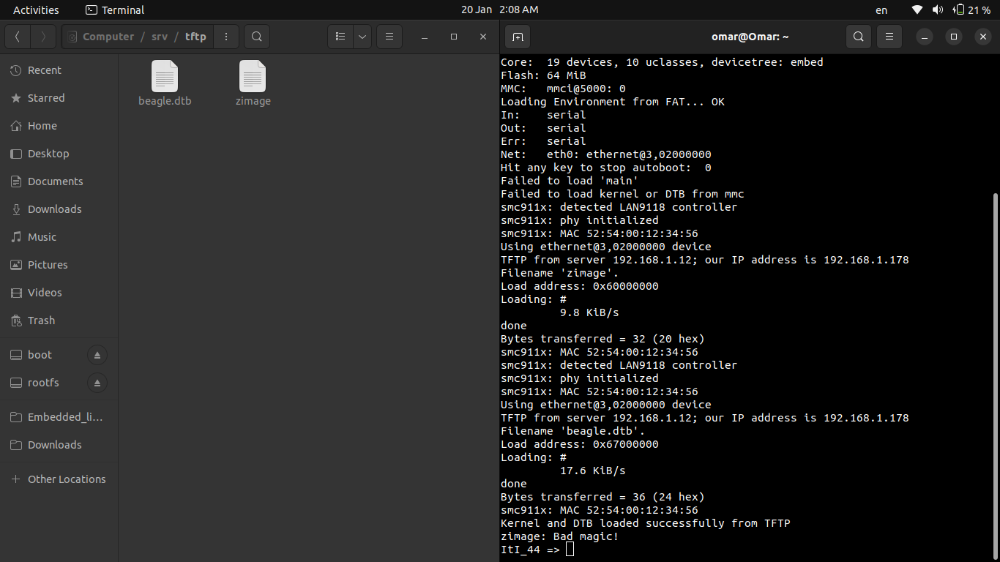
    
  * Case 5 :dtb files exists in mmc but zimage (main) does not  exist and files is missing from mmc
    
    
  * Case 6 :dtb and zimage (main) files does not  exist in mmc ot TFTB
  
    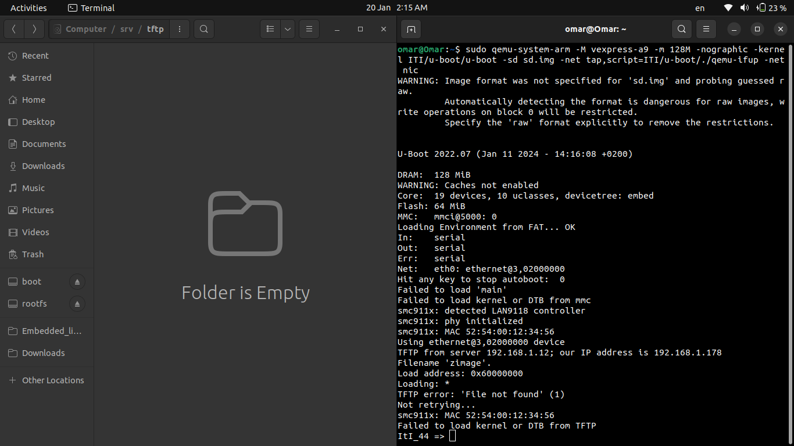
  
  * Case 7 : zimage (main) exists in mmc but dtb file does not  exist and files is missing from mmc
  
    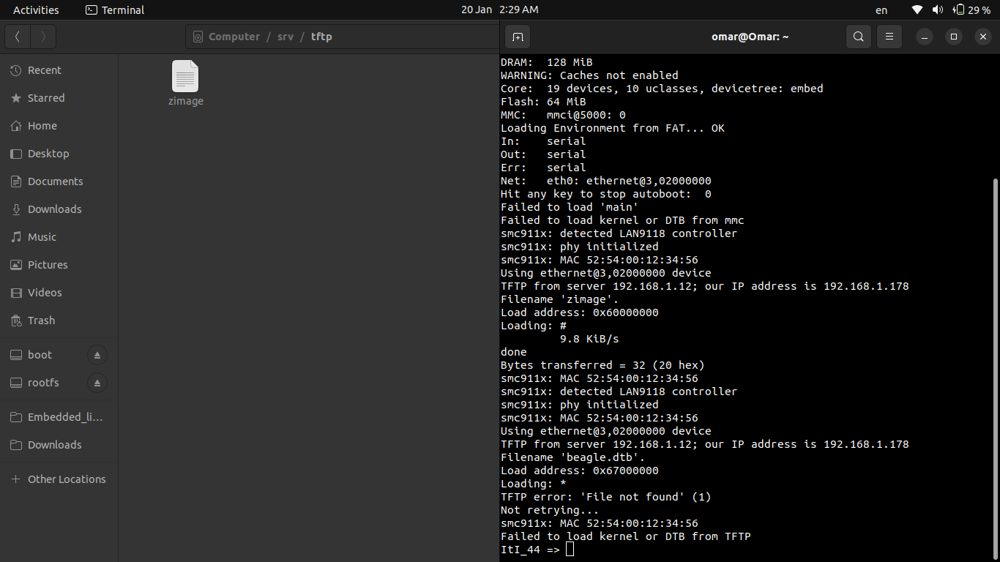
  
## 6. References 

- https://github.com/Omarmedhat0/EmbeddedLinux/tree/main/3-Uboot

- https://github.com/anaskhamees/Embedded_Linux/tree/main/EmbeddedLinuxTasks/Bootloader/Booting_TFTP_Server
- https://github.com/moelomda/Embedded-Linux/tree/main/Embedded_Linux_Concepts/U-Boot#boot-configuration-and-tftp-setup
- https://www.geeksforgeeks.org/what-is-tftp-trivial-file-transfer-protocol/