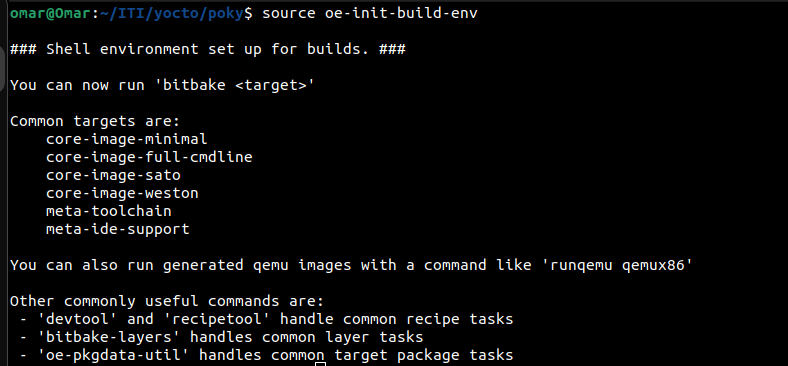
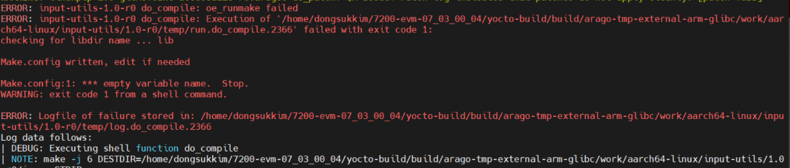

# Secure-Sync-Shield (Custom Image )

## Introduction

This project is built using the [Yocto Project](https://www.yoctoproject.org/), an open-source collaboration project that provides templates, tools, and methods to help you create custom Linux-based systems for embedded products, regardless of the hardware architecture. It's a complete embedded Linux development environment with tools, metadata, and documentation - everything you need.

The core part of the Yocto Project is [Poky](https://www.yoctoproject.org/docs/latest/overview-manual/overview-manual.html#poky), a reference distribution of the Yocto Project. It contains the OpenEmbedded Build System (BitBake and OpenEmbedded Core) as well as a set of metadata to get you started building your own distro.


The aim of project is to build an GUI using QT creator running on Raspberry 3b+ which has custom Linux image with the following features : 

* Auto Login 
* Support QT5 applications
* Support Wifi and Bluetooth 

## Project Details

This project includes the following features:

- OpenSSH server and SFTP server for secure file transfer
- Rsync for fast incremental file transfer
- X11vnc, a VNC server for real X displays
- Linux firmware and various utilities like i2c-tools, python3-smbus, bridge-utils, hostapd, iptables, iw, wpa-supplicant, and kernel-modules
- Development tools like make and cmake
- Coreutils and libunistring libraries
- Qt base tools and libraries, including qtbase, qtdeclarative, qtimageformats, qtmultimedia, qtquickcontrols2, qtquickcontrols, and qtbase-plugins
- Cinematicexperience and liberation-fonts for improved UI experience
- Systemd for system and service management
- Bluetooth and WiFi support
- IPv4 support
- Fontconfig support for qtbase
- Multi threading support with 4 threads

## Building the Project

> **CAUTION : Make sure you have an almost 100 GB free space on your hard disk as the building process take too much memory**

### Download Required Layers

First of all download Poky kirkstone branch as this version has Long-Term Support unit now and It's preferred  that to download all the following layers in the Poky directory after you clone it  

```bash
git clone -b kirkstone git://git.yoctoproject.org/poky.git
cd poky/
```

Download RPI BSP on  kirkstone branch

```bash
git clone -b kirkstone https://github.com/agherzan/meta-raspberrypi.git 
```

Download openembedded layer on  kirkstone branch

```bash
git clone -b kirkstone https://github.com/openembedded/meta-openembedded.git
```

Download QT5 layer on  kirkstone branch

```bash
git clone -b kirkstone https://github.com/meta-qt5/meta-qt5.git
```

### Setup The Environment For The Building Process 

* Run **oe-init-build-env** script for bitbake commands to another important environment variables 

  ```bash
  source oe-init-build-env
  ```

  

#### Adding The Downloaded Layers To The Project 

* You have 2 Options : 

  * Option 1 : 

    *  You add manually each downloaded layer except layers which downloaded by **Poky** by this command 

      ```bash
      bitbake-layers add-layer /path/to/layer 
      #Example for add meta-qt5 to my project 
      bitbake-layers add-layer /home/omar/ITI/yocto/poky/meta-qt5 
      ```

      and do this for all layers 

  * Option 2 : 

    * Open **bblayers.conf** and add them once in the file by this following steps : 

      > NOTE : ***bitbake-layers add-layer*** command  append the layer automatically in this file 

      ```bash
      #After you you source oe-init-build-env it automatically dircet you to thi path # /yocto/poky/build  
      nano conf/bblayers.conf 
      #or if you have VS open files from it 
      cd conf
      code . 
      ```

      Now add all new layers to it as following  and save it 

      ```bash
      # POKY_BBLAYERS_CONF_VERSION is increased each time build/conf/bblayers.conf
      # changes incompatibly
      POKY_BBLAYERS_CONF_VERSION = "2"
      
      BBPATH = "${TOPDIR}"
      BBFILES ?= ""
      BBLAYERS ?= " \
        /home/omar/ITI/yocto/poky/meta \
        /home/omar/ITI/yocto/poky/meta-poky \
        /home/omar/ITI/yocto/poky/meta-yocto-bsp \
        /home/omar/ITI/yocto/poky/meta-raspberrypi \
        /home/omar/ITI/yocto/poky/meta-secure-sync-shield \
        /home/omar/ITI/yocto/poky/meta-openembedded/meta-oe \
        /home/omar/ITI/yocto/poky/meta-openembedded/meta-python \
        /home/omar/ITI/yocto/poky/meta-openembedded/meta-networking \
        /home/omar/ITI/yocto/poky/meta-openembedded/meta-multimedia \
        /home/omar/ITI/yocto/poky/build/workspace \
        /home/omar/ITI/yocto/poky/meta-qt5 \
        "
      ```

#### Select the required features from the layers that will be exciting  in the image

* Now open **local.conf** by ant Text Editor and edit the following 

  ```bash
  nano conf/local.conf
  ```
  
* Edit the default machine by commented it add our the required machine that you build the image for it which will be  **raspberrypi3-64** at our case 

  ```bash
  #Comment qemux86-64"
  #MACHINE ?= "qemux86-64"
  
  #Add the required new machine 
  MACHINE ?= "raspberrypi3-64"
  ```

* Set a directory for downloads as you will download any dependencies for one time and re-use them every time you will build the image for any new features without re-download them again 

  > **CAUTION : Don't write any  a relative paths and put only an absolute paths **

  ```bash
  DL_DIR ?= "/home/omar/ITI/yocto/downloads"
  ```

* Set a directory for SSTATE to build any dependencies for one time and re-use them every time you will build the image for any new features without re-build them again 

  ```bash
  SSTATE_DIR ?= "/home/omar/ITI/yocto/sstate-cache"
  ```

* Now add those variables at the end of the filefor all features that you need at the current state to match the requirements

  ```bash
  #For OpenSSH server and SFTP server for secure file transfer 
  #For Rsync for fast incremental file transfer
  EXTRA_IMAGE_FEATURES += "ssh-server-openssh"
  IMAGE_INSTALL:append = " openssh-sftp-server rsync x11vnc "
  #For Bluetooth and WiFi support dependences
  #Install Linux firmware and various utilities like i2c-tools, python3-smbus, bridge-utils, hostapd, iptables, iw, wpa-supplicant, and kernel-modules
  IMAGE_INSTALL:append = " linux-firmware bluez5 i2c-tools python3-smbus bridge-utils hostapd iptables iw wpa-supplicant kernel-modules "
  #For QT and Development Tools install Make and Cmake
  IMAGE_INSTALL:append = " make cmake "
  #For QT5 Coreutils Install libunistring libraries Qt base tools and libraries, including qtbase, qtdeclarative, qtimageformats, qtmultimedia, qtquickcontrols2, qtquickcontrols, and qtbase-plugins 
  # Cinematicexperience and liberation-fonts for improved UI experience
  IMAGE_INSTALL:append = " coreutils libunistring qtbase-tools qtbase qtdeclarative qtimageformats qtmultimedia qtquickcontrols2 qtquickcontrols qtbase-plugins cinematicexperience liberation-fonts"
  #Systemd for system and service managementto mange services and add new services if needed
  #Enable wifi bluetooth ipv4
  DISTRO_FEATURES:append = " systemd usrmerge debug-tweaks bluez5 bluetooth wifi ipv4"
  PACKAGECONFIG_FONTS:append_pn-qtbase = " fontconfig"
  DISTRO_FEATUR/ES_BACKFILL_CONSIDERED += "sysvinit"
  VIRTUAL-RUNTIME_init_manager = "systemd"
  VIRTUAL-RUNTIME_initscripts = "systemd-compat-units"
  #Multithreading support with 4 threads for building
  BB_NUMBER_THREADS = "4"
  PARALLEL_MAKE = "-j 4"
  ```

* If required this lines for configure auto login for root user add those lines at the end of the file 

  ```bash
  IMAGE_FEATURES_REMOVE += " \
      debug-tweaks \
  "
   
  root_LOCAL_GETTY ?= " \
       ${IMAGE_ROOTFS}${systemd_system_unitdir}/serial-getty@.service \
       ${IMAGE_ROOTFS}${systemd_system_unitdir}/getty@.service \
  "
  # Define a function that modifies the systemd unit config files with the autologin arguments
  local_autologin () {
      sed -i -e 's/^\(ExecStart *=.*getty \)/\1--autologin root /' ${root_LOCAL_GETTY}
  }
  
  # Add the function so that it is executed after the rootfs has been generated
  ROOTFS_POSTPROCESS_COMMAND += "local_autologin; "
  ```

#### Build you image 

To build the project, use the `bitbake` command followed by the name of your image. and i will use sato image to build the image by at as it supports graphic requirements 

```bash
bitbake core-image-sato -k
```

> **Note** : For the first time the building process take too much time from 5 hrs or above according to your machine capabilities and your network speed 

* At the building process if any task failed to be built use this command to delete it's binaries and re-build it 

  ```bash
  bitbake -c cleansstate <Name of failed task>
  ```

  Example : 

  

  ```bash
  bitbake -c cleansstate input-utils
  bitbake core-image-sato -k
  #And so on
  ```

* At the end of build process you can run this command to delete duplication in binaries for sstate

  ```bash
  #as this directory in poky directory
  cd .. 
  
  ./scripts/sstate-cache-management.sh --cache-dir=../sstate-cache --remove-duplicated
  ```

  Now you should build your image successfully and you can find it under this path 

  ```bash
  cd ~/ITI/yocto/poky/build/tmp/deploy/images/raspberrypi3-64/
  ```

   
